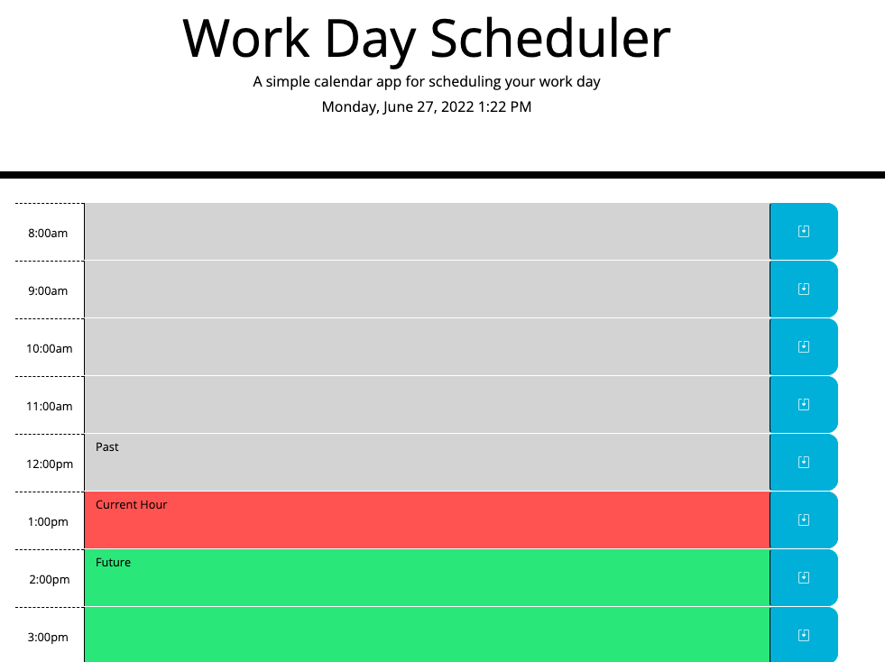

# schedule-gator

Using javascript, moment.js, jQuery, bootstrap, and the HTML and CSS given, I have created a dynamically updated daily task scheduler that simply allows users to add and delete tasks for each hour block of the workday. Based on the time, the hour "block"s will change color are past (grey), present(red), and future(green.) A user just needs to click the text area of the time block intended, mark the task, and click the button to save. By deleteing the text in the block and saving, tasks may be permanently removed.

# challenges

While using moment.js was intuitive, chosing how to get the colors to change per the hour was interesting. It is clear that it can be done in different ways! Adding an icon to the save button has some styling trouble that seems to be caused by the inherited css properties with the project. One tweak that I want to continue to work to solve is to use the setInterval function to refresh the page as the hour updates. 

## Acceptance Criteria

```
GIVEN I am using a daily planner to create a schedule
WHEN I open the planner
THEN the current day is displayed at the top of the calendar
<!-- COMPLETED -->

WHEN I scroll down
THEN I am presented with timeblocks for standard business hours
<!-- COMPLETED -->


WHEN I view the timeblocks for that day
THEN each timeblock is color coded to indicate whether it is in the past, present, or future
<!-- COMPLETED -->

WHEN I click into a timeblock
THEN I can enter an event
<!-- COMPLETED -->

WHEN I click the save button for that timeblock
THEN the text for that event is saved in local storage
<!-- COMPLETED -->

WHEN I refresh the page
THEN the saved events persist
<!-- COMPLETED -->
```

## Submition

* The URL of the deployed application.

https://bekind-rewind.github.io/schedule-gator/

* The URL of the GitHub repository. 

https://github.com/BeKind-Rewind/schedule-gator

* The URL of the README

https://github.com/BeKind-Rewind/schedule-gator/blob/main/README.md

* Screenshot




---
© 2022 Trilogy Education Services, LLC, a 2U, Inc. brand. Confidential and Proprietary. All Rights Reserved.

